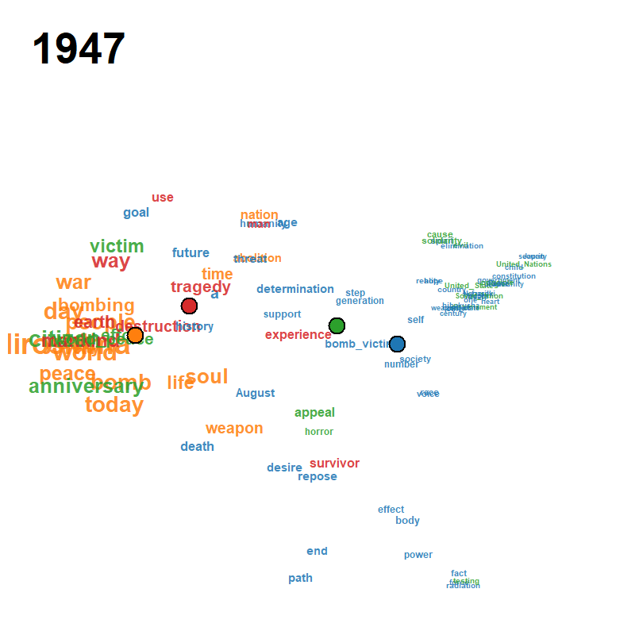
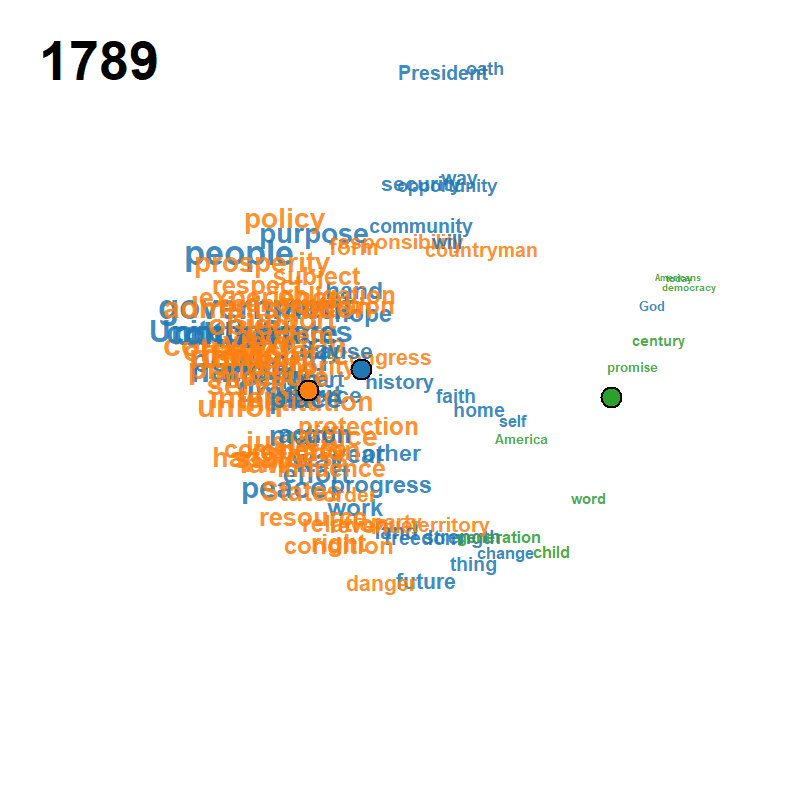

# ljmds: Local Jaccard MDS for Longitudinal Binary Data

R package implementing the methodology of Satoh (2026): visualisation
of longitudinal binary data (a time × attribute 0/1 matrix) by a
locally weighted Jaccard distance, multidimensional scaling with
sequential modification (Mizuta, 2003), Ward clustering on a
trajectory distance, and a functional Rousseeuw silhouette criterion
for joint selection of bandwidth and class number.

## Animated examples

Each frame plots the attributes on the modified MDS configuration
$\bm{y}_j(t)$ at calendar year $t$, with font/symbol size proportional
to the smoothed occurrence $f_j(t)$ and a fading trail of class
centroids over the previous frames.  Cluster colours follow the
default Classic Tableau palette and the silhouette criterion
$\mathcal{S}(k, h)$ jointly selects $(k, h)$ from a user-supplied
grid.

| Peace Declaration of Hiroshima (1947–2025, $h = 8$, $k = 4$) | US Presidential Inaugural Addresses (1789–2021, $h = 50$, $k = 3$) | Eurovision Song Contest (1956–2023, $h = 20$, $k = 5$) |
|:---:|:---:|:---:|
|  |  |  |

## Installation

```r
# Install from GitHub (private — request access from the author)
remotes::install_github("ksatohds/ljmds", build_vignettes = TRUE)
```

## Quick start

```r
library(ljmds)

# Peace Declaration of Hiroshima (built-in)
d <- ljmds.read.csv("peace_declaration")   # year + 95 keyword 0/1 columns
# d <- ljmds.read.csv("inaugural")          # alternative built-in
# d <- ljmds.read.csv(file = "my.csv")      # external CSV

# Joint (h, k) selection over a grid
# k = 1, 2 are excluded by leaving them out of k.grid (default 3:6).
sel <- ljmds.select(d$X, d$t,
                    h.grid = c(3, 4, 5, 6, 8, 10, 12, 15, 20))
sel$h.hat   # 8
sel$k.hat   # 4
sel$S.hat   # 0.201

# Full pipeline
fit <- ljmds.pipeline(d$X, d$t, h = sel$h.hat, k = sel$k.hat)

# Figures (default class.col = grDevices::palette.colors(8, "Classic Tableau"))
plot(fit, type = "trajectory")    # centroid trajectories on MDS map
plot(fit, type = "dendrogram")    # Ward dendrogram + class boxes
plot(fit, type = "cmd")           # time-collapsed MDS of trajectory distance
plot(fit, type = "means")         # class mean occurrence curves
plot(fit, type = "panels")        # per-class small multiples (square layout)
plot(sel)                          # silhouette heatmap with maximizer marker

# GIF animation
ljmds.animate(fit, file = "peace_declaration.gif", trail = 10, fps = 2)
```

## Data

Three longitudinal binary datasets ship under `inst/extdata`:

| File | n × p | Domain | Coverage |
|---|---|---|---|
| `peace_declaration.csv` | 78 × 95 | Text | Peace Declaration of Hiroshima, 1947–2025 (no 1950) |
| `inaugural.csv`         | 59 × 106 | Text | US Presidential Inaugural Addresses, 1789–2021 |
| `eurovision.csv`        | 68 × 52 | Non-text | Eurovision Song Contest country participation, 1956–2023 |

Each file has a header row, column 1 named `year`, and columns 2..
giving 0/1 indicators. The first two contain **no source
text** — they are derivative summaries.

### Provenance

#### `peace_declaration.csv` (78 × 95, 1947–2025)
- **Source**: scraped from the City of Hiroshima official site
  (English Peace Declarations) at
  <https://www.city.hiroshima.lg.jp/english/>.
- **Pre-processing**: tokenization, part-of-speech filtering and
  lemmatization with [UDPipe](https://lindat.mff.cuni.cz/services/udpipe/)
  (Straka & Straková, 2017) using the English Universal
  Dependencies model `english-ewt-ud-2.5-191206.udpipe`
  (CC-BY-SA-NC). Adjacent noun pairs were merged into compound
  keywords (e.g. `atomic_bomb`, `nuclear_weapons`,
  `United_Nations`); words appearing 20+ times in the whole
  corpus were retained as keywords.
- **Year coverage**: 78 years (1950 omitted because no
  declaration was delivered that year).
- **Reproducibility scripts**: `R取得20260504.R` (rvest scrape)
  and `R前処理20260504.R` (UDPipe + quanteda) in the project
  data directory; the bundled CSV is the final 0/1 matrix
  without any source text.

#### `inaugural.csv` (59 × 106, 1789–2021)
- **Source**: derived from the `data_corpus_inaugural` object
  shipped with the [`quanteda`](https://quanteda.io/) R package
  (Benoit, K. et al., 2018, *JOSS* 3(30), 774).
- **Pre-processing**: same UDPipe + quanteda pipeline as the
  Peace Declarations; words appearing 50+ times retained as
  keywords; adjacent noun pairs merged (e.g. `United_States`).
- **Year coverage**: 59 inaugural addresses delivered between
  1789 (Washington) and 2021 (Biden), at roughly four-year
  cadence.

#### `eurovision.csv` (68 × 52, 1956–2023)
- **Source**: derived from the **Eurovision dataset** of
  Spijkervet (2020) and the **Mirovision** living-dataset
  project of Burgoyne, Spijkervet & Baker (2023) at
  <https://github.com/Amsterdam-Music-Lab/mirovision>,
  released under the MIT licence by the
  [Amsterdam Music Lab](https://amsmusiclab.nl/) at the
  University of Amsterdam.
- **Pre-processing**: each row is a contest year, each column
  is a country, and the cell is 1 when that country fielded a
  contestant in that year and 0 otherwise. The 2020 contest was
  cancelled and is absent from the matrix.
- **Year coverage**: 68 contest years from 1956 (the first
  Eurovision Song Contest) to 2023.
- **Citations**:
  - Spijkervet, J. (2020). *The Eurovision Dataset* (version 1.0).
    Zenodo. [doi:10.5281/zenodo.4036457](https://doi.org/10.5281/zenodo.4036457)
  - Burgoyne, J. A., Spijkervet, J. & Baker, D. J. (2023).
    Measuring the Eurovision Song Contest: a living dataset for
    real-world MIR. In *Proc. 24th International Society for
    Music Information Retrieval Conference (ISMIR)*, Milan,
    Italy. <https://archives.ismir.net/ismir2023/paper/000097.pdf>

### Loading

```r
d <- ljmds.read.csv("peace_declaration")  # or "inaugural" / "eurovision"
str(d)                       # list(t = numeric n, X = n×p 0/1 matrix,
                             #      keywords = column names of X)
```

## Vignettes

```r
vignette("quickstart-peace", package = "ljmds")
vignette("quickstart-inaugural", package = "ljmds")
vignette("quickstart-eurovision", package = "ljmds")
```

Each vignette starts from the bundled CSV and reproduces the
diagnostic figures used in the corresponding application section
of the paper.

## References

- Rousseeuw, P.J. (1987) Silhouettes: a graphical aid to the
  interpretation and validation of cluster analysis.
  *Journal of Computational and Applied Mathematics* **20**, 53–65.
- Mizuta, M. (2003) Multidimensional scaling for dissimilarity
  functions with continuous argument.
  *Journal of the Japanese Society of Computational Statistics*
  **15**(2), 327–333.

## License

MIT.
