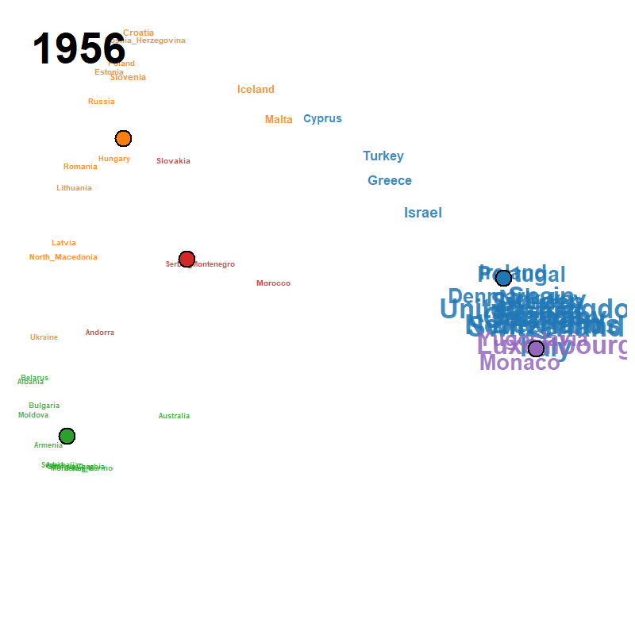

```{r, include = FALSE}
knitr::opts_chunk$set(
  collapse = TRUE, comment = "#>",
  fig.width = 7, fig.height = 6, dpi = 72,
  cache = TRUE
)
```

This vignette reproduces the figures used in Section 6 of the
companion paper, applied to the Eurovision Song Contest country
participation 1956--2023 (the 2020 contest was cancelled and is
absent from the matrix).  Unlike the other two examples, there
is **no text input at all**: the rows are contest years, the
columns are countries, and the cells are 1 / 0 indicators of
whether a given country fielded a contestant in a given year.
Source: the MIT-licensed
[Mirovision](https://github.com/Amsterdam-Music-Lab/mirovision)
dataset of Amsterdam Music Lab.

```{r setup}
library(ljmds)
```

## 1. Load the corpus from CSV

```{r load}
d <- ljmds.read.csv("eurovision")
dim(d$X)                  # 68 x 52
range(d$t)                # 1956 2023
head(d$keywords, 10)      # country names
```

## 2. Joint (h, k) selection

A minimal grid is used here so the vignette builds quickly;
a finer grid is recommended in practice (e.g.,
`h.grid = c(3, 5, 8, 12, 20)`).  The trivial `k = 2` split is
excluded by leaving 2 out of `k.grid` (default `3:6`).

```{r select}
sel <- ljmds.select(d$X, d$t,
                    h.grid = c(12, 20),
                    k.grid = 4:5)
sel$h.hat
sel$k.hat
sel$S.hat
round(sel$S, 3)
```

## 3. Run the pipeline at $(k, h) = (5, 20)$

```{r fit}
fit <- ljmds.pipeline(d$X, d$t, h = 20, k = 5)
```

## 4. Figures from the paper

### Figure 17: cluster centroid trajectories

```{r fig17, fig.cap = "Centroid trajectories on the modified MDS configuration."}
plot(fit, type = "trajectory")
```

### Figure 18: class mean participation curves

```{r fig18, fig.cap = "Class mean participation probability curves."}
plot(fit, type = "means")
```

### Figure 19: Ward dendrogram

```{r fig19, fig.cap = "Ward dendrogram on the trajectory distance H."}
plot(fit, type = "dendrogram")
```

### Figure 20: silhouette selection heatmap

```{r fig20, fig.cap = "Silhouette heatmap S(k, h) with maximizer marker."}
plot(sel)
```

### Figure 21: time-collapsed MDS map

```{r fig21, fig.cap = "Classical MDS of H, coloured by class."}
plot(fit, type = "cmd")
```

### Figure 22: per-class small multiples

```{r fig22, fig.cap = "Individual smoothed curves and class means."}
plot(fit, type = "panels")
```

### Figure 23: animated trajectory map (GIF)

A pre-rendered animation ships with the package; locate it
with `system.file()` and view it directly:

```{r gif-path}
gif_path <- system.file("extdata", "eurovision.gif",
                        package = "ljmds")
gif_path
```

```{r view-gif, eval = FALSE}
browseURL(gif_path)              # open in default browser
# magick::image_read(gif_path)   # or: open in RStudio Viewer
```

```{r show-gif, echo = FALSE, out.width = "100%"}

```

To regenerate the GIF from the fitted object (writes a new file
to the current working directory), uncomment and run:

```{r regen-gif, eval = FALSE}
# gif <- ljmds.animate(fit, file = "eurovision.gif",
#                      trail = 7, fps = 2)
```
